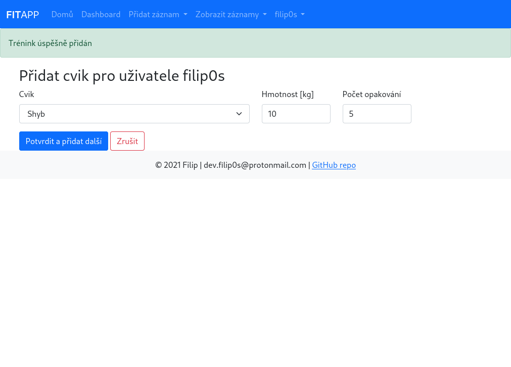

# 🏋️‍♂️ FitApp 

## About
Minimalistic web application written in Python with use of Flask microframework.
Main purpose of this app is to log progress in working out and healthy lifestyle in general.
Application is part of semester project for Python course on my university.

## Used technologies
- **Front-end** - HTML, CSS, Bootstrap 5
- **Back-end** - Python, Flask, Matplotlib
- **Database** - SQLite

## Features
* User system
* Logging physical attributes
  * Weight
  * Height
* Logging lifts
* Running logs
* Progress visualization with graphs

## Application setup

### Prerequisites
* [Python 3](https://www.python.org/downloads/) and [Git](https://git-scm.com/download/linux) installed on the system


### Downloading the project

```shell
git clone github.com/filip0s/fitapp-web
cd fitapp-web
python -m venv /venv # create virtual environment so the dependencies won't clutter your system
source /venv/bin/activate # activate virtual environment
pip install -r requirements.txt # installing dependencies
cd fitapp; cp .env_example .env # Creates .env file and fills it with placeholder values
```

### Setting envrionment variables
1. In the `.env` file created in previous 
step, fill corresponding values to keys
    * for example `FITAPP_SECRET_KEY=my-super-secret-password`
2. Before launching the application you need to setup two additional
environment variables
```shell
export FLASK_APP=fitapp
export FLASK_ENV=development # Export this one only if you want to run application in development mode
```

### Running local server
* Finally you can start local server with

```shell
flask run
```
* The application is not yet fully functional because database is not migrated yet.
* You need to do this step before migration, because database file `fitapp/fitapp.db` will be created on the first run
of the application

### Database migration
* To migrate the database you will need to run following commands

```shell
flask db init
flask db migrate
flask db upgrade
```

* If the databases are succesfully migrated but no values are stored inside of them (especially in the
`exercies` and `exercise_type` tables), manually migrate the values inside the `migrations/exercises.sql` file with the help of any program which offers you console to the database (e.g. [SQLite browser](https://github.com/sqlitebrowser/sqlitebrowser))
* Now finally you should be able to fully run the application.


## Screenshots




